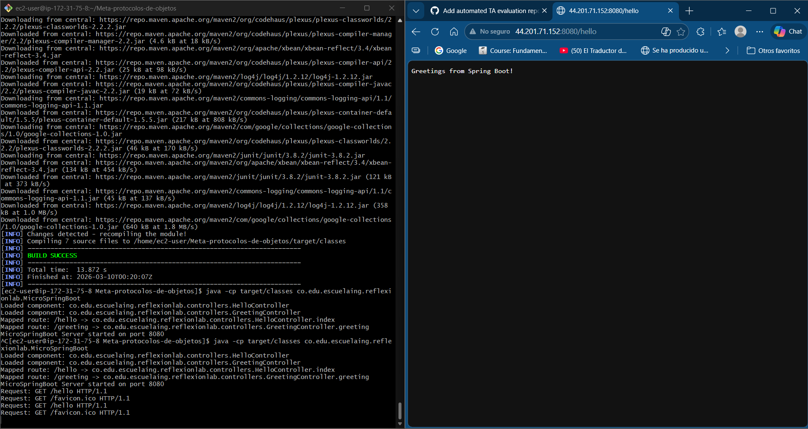
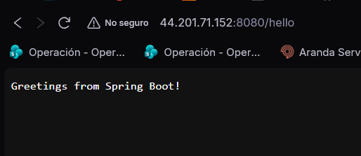
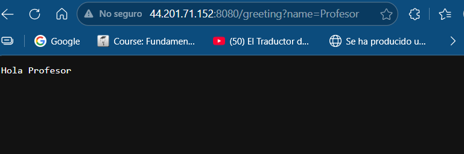
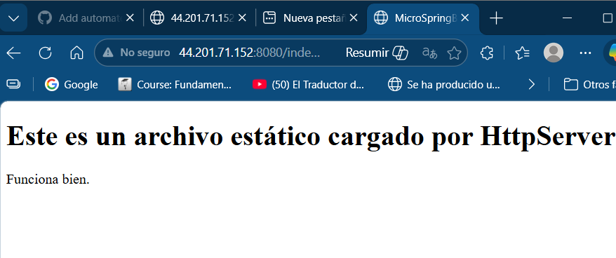

# Taller de Arquitecturas: Meta Protocolos de Objetos, Servidor Web e IoC Framework

Un servidor Web ligero en Java (tipo Apache) construido desde cero utilizando Sockets TCP nativos, que implementa un Framework de Inversión de Control (IoC) basado en la manipulación de Meta Protocolos mediante la API de Reflexión de Java.

## Descripción

El proyecto consiste en dos componentes principales:
1. **Servidor HTTP:** Capaz de recibir y procesar peticiones web. Puede entregar de forma nativa recursos estáticos (imágenes PNG, páginas HTML, CSS, JS) almacenados en la carpeta `src/main/resources/public`.
2. **MicroSpringBoot (Framework IoC):** Un motor reflexivo que escanea el _classpath_ del proyecto durante su inicialización buscando clases marcadas como componentes (`@RestController`). Utiliza reflexión dinámica para registrar los métodos anotados (`@GetMapping`) a diferentes rutas URI y posteriormente invocarlos a solicitud del servidor inyectando valores mapeados desde la petición HTTP (`@RequestParam`).

## Requisitos Previos

Para ejecutar y compilar este proyecto, necesitas tener instalado:

- Java Development Kit (JDK) 8 o superior.
- Apache Maven (Gestor de dependencias y empaquetado).
- Git (Opcional, para el clonado del repositorio).

## Instalación y Ejecución

Sigue estos pasos para compilar y probar la aplicación en tu entorno de desarrollo local.

1. **Clona o descarga el repositorio** en tu máquina local:
   ```bash
   git clone <url-de-tu-repositorio>
   cd Meta-protocolos-de-objetos
   ```

2. **Compila el proyecto con Maven**. Este comando descargará requerimientos, limpiará entregas anteriores y compilará las clases de Java:
   ```bash
   mvn clean compile
   ```

3. **Inicia el Servidor de Aplicaciones**. Emplea la JVM para arrancar la clase central del framework:
   ```bash
   java -cp target/classes co.edu.escuelaing.reflexionlab.MicroSpringBoot
   ```

Verás una salida en consola indicando que se han cargado los componentes y que el servidor de *MicroSpringBoot* ha iniciado exitosamente en el puerto `8080`.

## Guía de Uso Rápida y Evidencias

A continuación, se presentan las pruebas de ejecución locales y en la nube (AWS), demostrando el correcto funcionamiento del Framework IoC y el Servidor HTTP estático:

### 1. Despliegue en Amazon Web Services (AWS)



**Análisis de la arquitectura en la nube:**
Para este hito, el servidor `MicroSpringBoot` fue empaquetado y subido a una instancia híbrida de EC2 en Amazon Web Services. Se evidenció que la API de reflection de Java compilada nativamente operó sin problemas bajo un entorno Linux remoto. Las reglas de entrada del Security Group fueron configuradas para permitir tráfico TCP por el puerto 8080, logrando un despliegue exitoso accesible mediante la IP pública proveída por Amazon.

### 2. Prueba de Mapeo Básico (@GetMapping)



**Análisis de Inversión de Control:**
Al iniciar el servidor, el Component Scanner recorrió el *classpath* encontrando la clase `HelloController` anotada con `@RestController`. Haciendo uso reflexivo de `Class.forName()` y `Method.invoke()`, la solicitud HTTP de tipo `GET` entrante por el socket fue redirigida a la función `index()`, y el resultado en formato `String` fue empaquetado correctamente en una respuesta HTTP `200 OK` legible por el navegador.

### 3. Prueba de Inyección de Parámetros (@RequestParam)



**Análisis del Query String:**
La plataforma IoC implementada fue probada con inyección por query. Al detectar la anotación `@RequestParam`, el framework extrae variables y valores de la solicitud HTTP sin procesar ("`?name=Profesor`") inyectándolos dinámicamente en los parámetros de tipo `String` del método `greeting`.

### 4. Prueba de Servidor de Archivos Estáticos y Multimedia



**Análisis sobre entrega asíncrona de recursos:**
Para corroborar que el framework funcionaba verdaderamente como un Servidor Web tipo Apache (y no solo como backend REST), se configuró una ruta de búsqueda en `src/main/resources/public`. Al solicitar un recurso que no hace match con ninguna ruta anotada (por ejemplo `/logo.png`), el despachador de sockets procede a leer en formato asíncrono los Bytes del PNG/HTML desde el disco, componiendo el MIME Type correcto (`image/png` / `text/html`) asegurando que el navegador reciba e interpole visualmente los recursos estáticos.

## Construido Con

*   **Java (JDK)** - Lenguaje y base lógica. API Reflection.
*   **Java Sockets** - API Nativa para concurrencia básica y peticiones web (`java.net.ServerSocket`).
*   **Apache Maven** - Dependencias, compilación y empaquetado del ciclo de vida.

## Autores

*   **Juan Pablo Nieto Cortes** - *Trabajo y desarrollo completo* - (https://github.com/JuanPablo990)

## Licencia

Este proyecto está licenciado bajo la **MIT License** - vea el archivo [LICENSE](LICENSE) para más detalles.